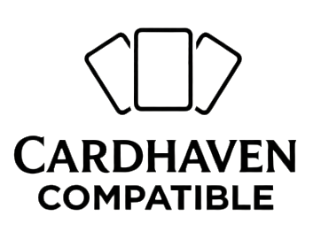

# Cardhaven Ruleset

The official open-source release of the Cardhaven game system, created by M.A. Lionmayne and published by Pandiego Press.

## What This Is

The Cardhaven Ruleset is the mechanical system underlying the Cardhaven novel series — a card-based progression fantasy system featuring:

- Four core stats (STR, CON, INT, DEX) with derived resource pools (Focus, HP, Stamina, Mana, Agility)
- Card Slots and card installation mechanics
- The Triple Bind resource economy (Economy / Crafting / Progression)
- Shard types, XP economy, and Leveling Rituals
- Card rarity tiers (Common → Uncommon → Rare → Legendary → Mythic)
- Dungeon difficulty ratings (Rank D through Rank S)
- Crafting rules (Core + Fuel Shard recipe system)

This ruleset is released under CC BY-SA 4.0 so that other authors, game designers, and community creators can build compatible content.

## What This Is NOT

The CC BY-SA 4.0 license covers the **mechanical system only**. The following are NOT open-source and remain fully protected under copyright:

- The Cardhaven novel series and all fiction published under the M.A. Lionmayne pen name
- The world of Arkturon, Aerith Hold, Titan's Edge, the Great Shallows, and all named locations
- All characters (Aric Dalan, Ximena Vega, Elara, Bran, Faelan, Lyra, Anara Voss, and all others)
- **Blu Beaks** — this signature creature of the Cardhaven universe is proprietary and NOT included in the open bestiary. Third-party content may not use Blu Beaks without a separate licensing arrangement with Pandiego Press.
- The Cardhaven Compatible logo and branding assets
- Any story, lore, or narrative content from the novels

The following ARE open under CC BY-SA 4.0:
- The mechanical game system (stats, cards, Triple Bind, progression, crafting, dungeon difficulty ratings)
- Creature stat blocks published in the /bestiary/ folder (e.g. Tide-Stalkers, Crag-Lord, Bramble Warden) — note that Blu Beaks are explicitly excluded from this open release

If you want to write a novel or story set in the Cardhaven world, that requires a separate licensing arrangement with Pandiego Press.

## Cardhaven Compatible

Third-party content that uses this ruleset and meets our compatibility standards may apply to use the Cardhaven Compatible badge. See [COMPATIBILITY.md](COMPATIBILITY.md) for requirements, and [COMPATIBLE-PRODUCTS.md](COMPATIBLE-PRODUCTS.md) for the list of approved products.

## Contributing

See [CONTRIBUTING.md](CONTRIBUTING.md). All contributions are welcome via pull request. By submitting a PR you agree to release your contribution under the same CC BY-SA 4.0 terms.

## Official Releases

The Cardhaven novel series is published by Pandiego Press.
- *Cardhaven: Book One* by M.A. Lionmayne (2026)
